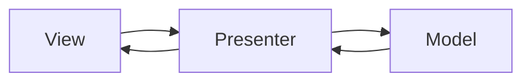
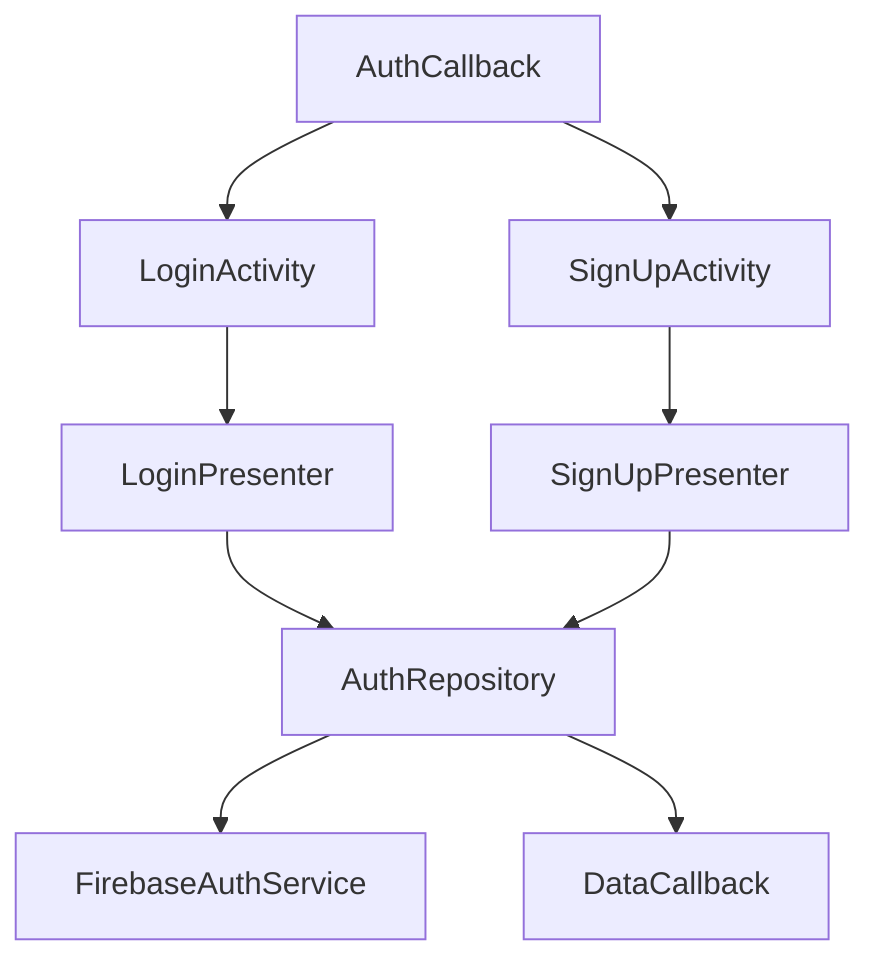
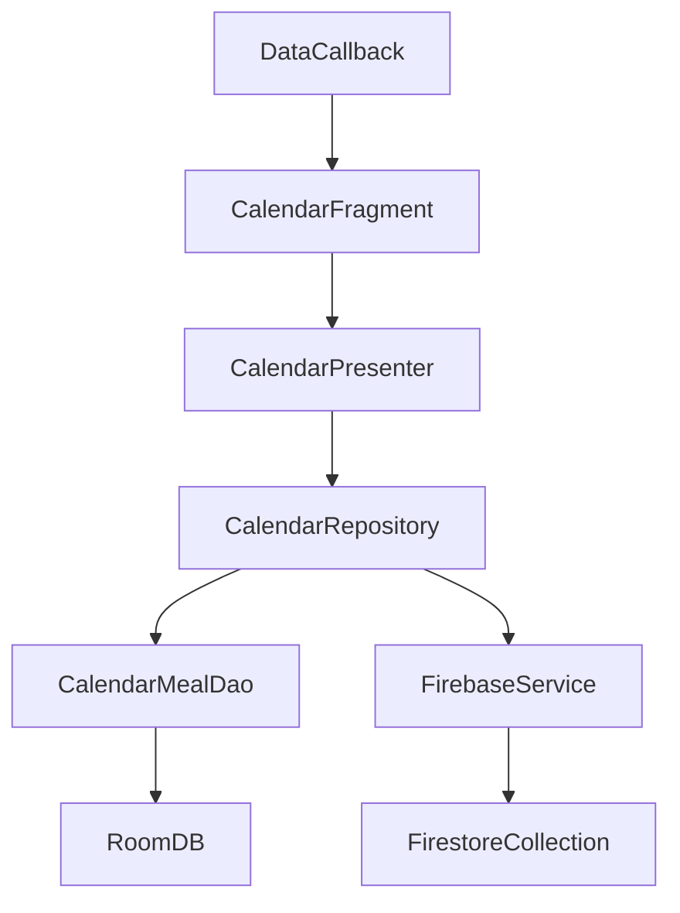
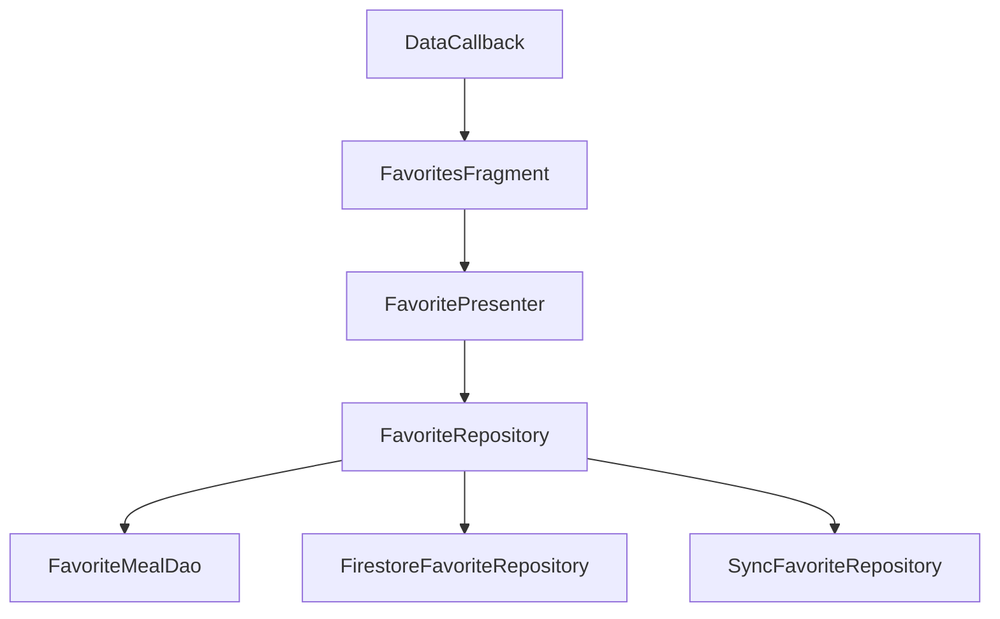

# Akol-Eih? Food Planner App

## Table of Contents

1. [Overview](#overview)
2. [Architecture](#architecture)
3. [Module Breakdown](#module-breakdown)

   * [Auth](#auth-module)
   * [Calendar](#calendar-module)
   * [Favorites](#favorites-module)
   * [Home](#home-module)
   * [Profile](#profile-module)
   * [Search](#search-module)
   * [Splash](#splash-module)
   * [Utils](#utils)
4. [Project Structure](#project-structure)
5. [Setup & Installation](#setup--installation)
6. [Building & Running](#building--running)
7. [Contributing](#contributing)
8. [License](#license)

---

## Overview

`Akol-Eih?` is a Java-based Android application for planning meals, browsing recipes, saving favorites, and scheduling weekly meal plans. It follows the Model–View–Presenter (MVP) pattern to separate concerns and make the codebase scalable and testable.

This README provides detailed information on the app's architecture, modules, directory structure, and instructions for setup.

---

## Architecture

The app adheres to the MVP pattern:



* **Model**: Handles data operations (network calls, database, repositories).
* **View**: UI layer (Activities, Fragments, Adapters) that displays data.
* **Presenter**: Middleman that retrieves data from Model and updates the View.

---

## Module Breakdown

### Auth Module

Handles user authentication (signup, login) via Firebase and local data callbacks.



* **Model** (`com.example.akoleih.auth.model`)

  * `User.java`
  * `AuthRepository` / `AuthRepositoryImpl.java`
  * Callbacks: `AuthCallback.java`, `DataCallback.java`
* **Presenter** (`com.example.akoleih.auth.presenter`)

  * `LoginPresenter.java` / `LoginPresenterImpl.java`
  * `SignUpPresenter.java` / `SignUpPresenterImpl.java`
* **View** (`com.example.akoleih.auth.view`)

  * `LoginActivity.java` / `LoginView.java`
  * `SignUpActivity.java` / `SignUpView.java`

### Calendar Module

Allows users to plan meals on a weekly calendar, persist data in Room and sync with Firebase.



* **Model** (`com.example.akoleih.calendar.model`)

  * Room: `CalendarMeal.java`, `CalendarMealDao.java`
  * Repositories: `CalendarRepository` / `CalendarRepositoryImpl.java`
  * Firebase: `FirebaseService` / `FirebaseServiceImpl.java`
* **Presenter** (`com.example.akoleih.calendar.presenter`)

  * `CalendarPresenter.java` / `CalendarPresenterImpl.java`
* **View** (`com.example.akoleih.calendar.view`)

  * `CalendarFragment.java`, `CalendarAdapter.java`, `CalendarView.java`
  * Decorators: `CalendarDecorators.java`

### Favorites Module

Manages offline and online (Firestore) favorites with sync capabilities.



* **Model** (`com.example.akoleih.favorite.model`)

  * Database: `AppDatabase.java`, `FavoriteMealDao.java`, `FavoriteMeal.java`
  * Repositories: `FavoriteRepository` / `FavoriteRepositoryImpl.java`
  * Online: `FirestoreFavoriteRepositoryImpl.java`
  * Sync: `SyncFavoriteRepositoryImpl.java`
* **Presenter** (`com.example.akoleih.favorite.presenter`)

  * `FavoritePresenter.java` / `FavoritePresenterImpl.java`
* **View** (`com.example.akoleih.favorite.view`)

  * `FavoritesFragment.java`, `FavoriteAdapter.java`, `OnMealClickListener.java`

### Home Module

Displays categories, ingredients, and meals from remote APIs using Retrofit.

* **Model** (`com.example.akoleih.home.model`)

  * Data Classes: `Category.java`, `Ingredient.java`, `Meal.java`
  * Network: Retrofit interfaces (`CategoryApiService.java`, `MealApiService.java`), data sources, `RetrofitClient.java`
  * Repository: `HomeRepository` / `HomeRepositoryImpl.java`, `HomeViewModel.java`
* **Presenter** (`com.example.akoleih.home.presenter`)

  * `HomePresenter.java` / `HomePresenterImpl.java`
* **View** (`com.example.akoleih.home.view`)

  * Fragments: `HomeFirstFragment.java`, `HomeMealsSecondFragment.java`, `HomeMealDetailsThirdFragment.java`, `VideoFragment.java`
  * Adapters: categories, countries, ingredients, meals, random meals

### Profile Module

Shows and updates user profile information.

* **Model** (`com.example.akoleih.profile.model`)

  * `UserProfile.java`, `ProfileRepository` / `ProfileRepositoryImpl.java`
* **Presenter** (`com.example.akoleih.profile.presenter`)

  * `ProfilePresenter.java` / `ProfilePresenterImpl.java`
* **View** (`com.example.akoleih.profile.view`)

  * `ProfileActivity.java`, `ProfileView.java`

### Search Module

Implements search across meals using remote API.

* **Model** (`com.example.akoleih.search.model`)

  * Retrofit: `SearchApiService.java`, `SearchRemoteDataSourceImpl.java`
  * Repository: `SearchRepository` / `SearchRepositoryImpl.java`, `SearchViewModel.java`
  * Data: `SearchMeal.java`
* **Presenter** (`com.example.akoleih.search.presenter`)

  * `SearchPresenter.java` / `SearchPresenterImpl.java`
* **View** (`com.example.akoleih.search.view`)

  * `SearchActivity.java`, `SearchMealsAdapter.java`, `SearchView.java`

### Splash Module

Initial loading and splash screen logic.

* **Presenter** (`com.example.akoleih.splash.presenter`)

  * `SplashPresenter.java` / `SplashPresenterImpl.java`
* **View** (`com.example.akoleih.splash.view`)

  * `SplashActivity.java`, `SplashView.java`

### Utils

Reusable utilities:

* `NetworkUtil.java` – checks connectivity
* `SharedPrefUtil.java` – shared preferences helper
* `SearchValidator.java` – validates user input
* `CustomLoginDialog.java`, `NoInternetDialog.java` – common dialogs
* `CountryFlagUtil.java` – load flags by country code

---

## Project Structure

```text
com/example/akoleih/
├── auth/       # Authentication flows
├── calendar/   # Calendar meal planning
├── favorite/   # Favorite meals management
├── home/       # Browse categories & meals
├── profile/    # User profile screens
├── search/     # Search functionality
├── splash/     # Splash screen
├── utils/      # Common utilities
├── MainApplication.java
└── NavigationActivity.java
```

---

## Setup & Installation

1. Clone the repo:

   ```bash
   git clone https://github.com/your-org/akol-eih.git
   cd akol-eih
   ```
2. Open in Android Studio (minimum API 21).
3. Ensure you have Google Play Services (for Firebase) and Internet permission in `AndroidManifest.xml`.
4. Add your Firebase config (`google-services.json`) in `app/`.
5. Sync Gradle to download dependencies:

   ```gradle
   implementation 'com.google.firebase:firebase-auth:21.0.1'
   implementation 'com.google.firebase:firebase-firestore:24.0.0'
   implementation 'androidx.room:room-runtime:2.4.2'
   implementation 'com.squareup.retrofit2:retrofit:2.9.0'
   // ... other libs
   ```

---

## Building & Running

1. Build the project in Android Studio (Build → Make Project).
2. Run on emulator or physical device (min API 21, Internet).
3. The bottom navigation will show Home, Calendar, Favorites, Profile.

---

## Contributing

1. Fork the repository.
2. Create a feature branch: `git checkout -b feature/YourFeature`
3. Commit your changes and open a Pull Request.
4. Ensure all modules follow MVP and include tests for presenters.

---

## License

This project is licensed under the MIT License. See `LICENSE` for details.
