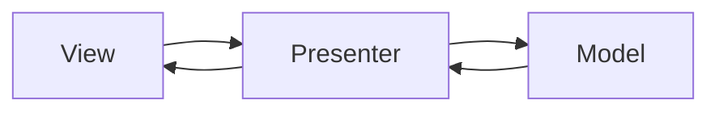
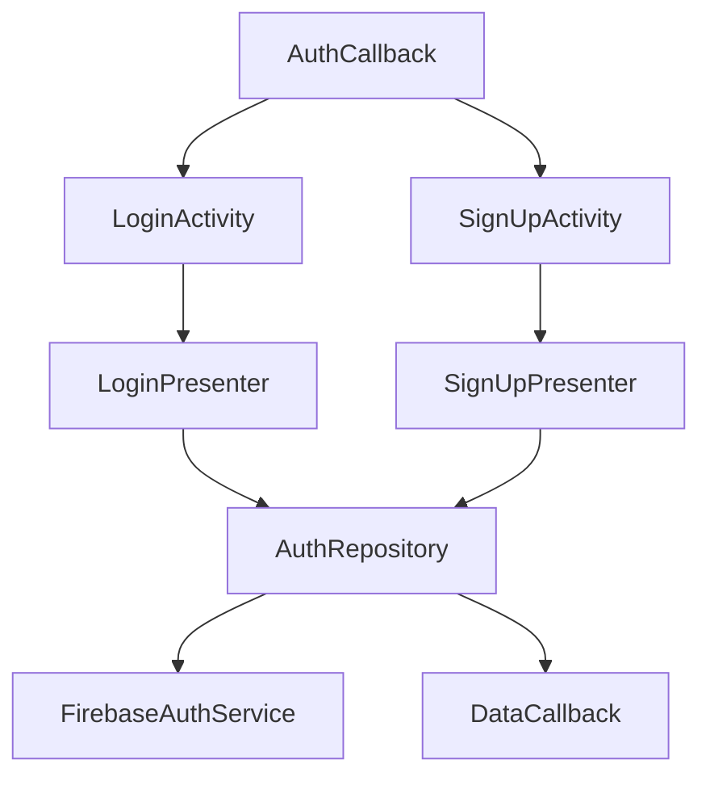
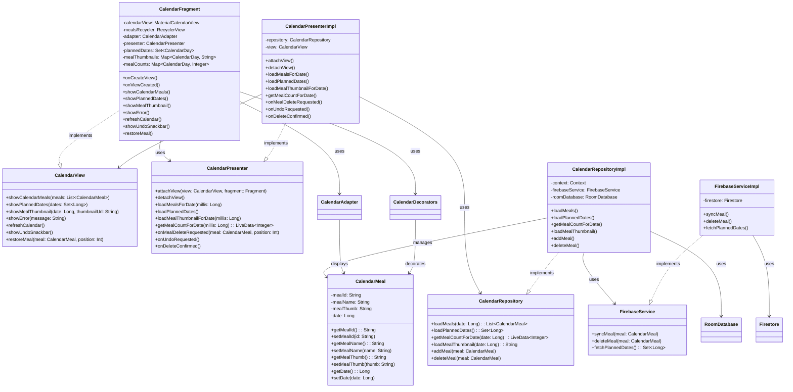

# Akol-Eih? Food Planner App

## Table of Contents

1. [Overview](#overview)
2. [Architecture](#architecture)
3. [Module Breakdown](#module-breakdown)

   * [Auth](#auth-module)
   * [Calendar](#calendar-module)
   * [Favorites](#favorites-module)
   * [Home](#home-module)
   * [Profile](#profile-module)
   * [Search](#search-module)
   * [Splash](#splash-module)
   * [Utils](#utils)
4. [Project Structure](#project-structure)

---

## Overview

`Akol-Eih?` is a Java-based Android application for planning meals, browsing recipes, saving favorites, and scheduling weekly meal plans. It follows the Model–View–Presenter (MVP) pattern to separate concerns and make the codebase scalable and testable.

This README provides detailed information on the app's architecture, modules, directory structure, and instructions for setup.

---

## Architecture

The app adheres to the MVP pattern:



* **Model**: Handles data operations (network calls, database, repositories).
* **View**: UI layer (Activities, Fragments, Adapters) that displays data.
* **Presenter**: Middleman that retrieves data from Model and updates the View.

---

## Module Breakdown

### Auth Module

Handles user authentication (signup, login) via Firebase and local data callbacks.



* **Model** (`com.example.akoleih.auth.model`)

  * `User.java`
  * `AuthRepository` / `AuthRepositoryImpl.java`
  * Callbacks: `AuthCallback.java`, `DataCallback.java`
* **Presenter** (`com.example.akoleih.auth.presenter`)

  * `LoginPresenter.java` / `LoginPresenterImpl.java`
  * `SignUpPresenter.java` / `SignUpPresenterImpl.java`
* **View** (`com.example.akoleih.auth.view`)

  * `LoginActivity.java` / `LoginView.java`
  * `SignUpActivity.java` / `SignUpView.java`

### Calendar Module

Allows users to plan meals on a weekly calendar, persist data in Room and sync with Firebase.



### Favorites Module

Manages offline and online (Firestore) favorites with sync capabilities.

```mermaid
classDiagram
    class FavoriteView {
        +showFavorites(favorites: List~FavoriteMeal~)
        +showEmpty()
        +showError(message: String)
        +onFavoriteRemoved(position: int)
        +onFavoriteRestored(meal: FavoriteMeal, position: int)
        +showUndoSnackbar()
    }

    class FavoritesFragment {
        -presenter: FavoritePresenter
        -adapter: FavoriteAdapter
        -rvFavorites: RecyclerView
        -emptyStateView: View
        +onCreateView()
        +onViewCreated()
        +showFavorites()
        +showEmpty()
        +showError()
        +onFavoriteRemoved()
        +onFavoriteRestored()
        +showUndoSnackbar()
        +onMealClick(meal: FavoriteMeal)
        +onDestroyView()
    }

    class FavoritePresenter {
        +attachView(view: FavoriteView, lifecycleOwner: LifecycleOwner)
        +detachView()
        +loadFavorites()
        +addFavorite(meal: FavoriteMeal)
        +deleteFavorite(meal: FavoriteMeal, position: int)
        +undoDelete()
        +getFavoritesLiveData(): LiveData~List~FavoriteMeal~~
    }

    class FavoritePresenterImpl {
        -view: FavoriteView
        -lifecycleOwner: LifecycleOwner
        -repo: FavoriteRepository
        -favoritesLiveData: LiveData~List~FavoriteMeal~~
        -removedMeal: FavoriteMeal
        -lastRemovedPosition: int
        +attachView()
        +detachView()
        +loadFavorites()
        +addFavorite()
        +deleteFavorite()
        +undoDelete()
        +getFavoritesLiveData()
    }

    class FavoriteRepository {
        +getFavorites(): LiveData~List~FavoriteMeal~~
        +getFavoriteById(id: String): LiveData~FavoriteMeal~
        +addFavorite(meal: FavoriteMeal)
        +removeFavorite(meal: FavoriteMeal)
        +syncFavoritesFromFirestore(callback: DataCallback~Void~)
        +syncFavoritesOnStartup(context: Context)
        +clearFavoriteData()
    }

    class SyncFavoriteRepositoryImpl {
        -dao: FavoriteMealDao
        -firestoreRepo: FirestoreFavoriteRepositoryImpl
        -executor: ExecutorService
        -mainHandler: Handler
        +getFavorites()
        +getFavoriteById()
        +addFavorite()
        +removeFavorite()
        +syncFavoritesFromFirestore()
        +syncFavoritesOnStartup()
        +clearFavoriteData()
    }

    class FirestoreFavoriteRepositoryImpl {
        -db: FirebaseFirestore
        -auth: FirebaseAuth
        -favoritesLiveData: MutableLiveData~List~FavoriteMeal~~
        -listener: ListenerRegistration
        +getFavorites()
        +getFavoriteById()
        +addFavorite()
        +removeFavorite()
        +clearFavoriteData()
        +cleanup()
    }

    class FavoriteRepositoryImpl {
        -dao: FavoriteMealDao
        +getFavorites()
        +getFavoriteById()
        +addFavorite()
        +removeFavorite()
        +syncFavoritesFromFirestore()
        +syncFavoritesOnStartup()
        +clearFavoriteData()
    }

    class FavoriteMealDao {
        +insert(meal: FavoriteMeal)
        +insertAll(meals: List~FavoriteMeal~)
        +delete(meal: FavoriteMeal)
        +deleteAll()
        +getAllFavorites(): LiveData~List~FavoriteMeal~~
        +getFavoriteById(id: String): LiveData~FavoriteMeal~
    }

    class AppDatabase {
        -INSTANCE: AppDatabase
        +favoriteMealDao(): FavoriteMealDao
        +calendarMealDao(): CalendarMealDao
        +getInstance(context: Context): AppDatabase
        +clearInstance()
    }

    class FavoriteMeal {
        -idMeal: String
        -strMeal: String
        -strMealThumb: String
        +getIdMeal(): String
        +setIdMeal(id: String)
        +getStrMeal(): String
        +setStrMeal(name: String)
        +getStrMealThumb(): String
        +setStrMealThumb(thumb: String)
    }

    class FavoriteAdapter {
        -data: ArrayList~FavoriteMeal~
        -deleteListener: OnFavDeleteClickListener
        -mealListener: OnMealClickListener
        +setData(newData: List~FavoriteMeal~)
        +removeItem(position: int)
        +restoreItem(meal: FavoriteMeal, position: int)
        +setMealClickListener(listener: OnMealClickListener)
    }

    class OnMealClickListener {
        +onMealClick(meal: FavoriteMeal)
    }

    class Resource {
        +Success~T~: data
        +Error~T~: message
    }

    class SnackbarUtil {
        +showError(root: View, message: String)
        +showUndoSnackbar(root: View, onUndo: Runnable, iconRes: int, textRes: int, actionTextRes: int): Snackbar
    }

    class NavigationHandler {
        +navigateToMealDetails(mealId: String)
    }

    FavoritesFragment ..|> FavoriteView : implements
    FavoritesFragment ..|> OnMealClickListener : implements
    FavoritesFragment --> FavoritePresenter : uses
    FavoritesFragment --> FavoriteAdapter : uses
    FavoritesFragment --> HomeMealDetailsThirdFragment : navigates to
    FavoritesFragment --> SnackbarUtil : uses (optional)
    FavoritesFragment ..> NavigationHandler : implements (optional)

    FavoritePresenterImpl ..|> FavoritePresenter : implements
    FavoritePresenterImpl --> FavoriteRepository : uses
    FavoritePresenterImpl --> FavoriteView : updates
    FavoritePresenterImpl --> Resource : uses (optional)

    SyncFavoriteRepositoryImpl ..|> FavoriteRepository : implements
    SyncFavoriteRepositoryImpl --> FavoriteMealDao : uses
    SyncFavoriteRepositoryImpl --> FirestoreFavoriteRepositoryImpl : uses
    SyncFavoriteRepositoryImpl --> FavoriteMeal : manages
    SyncFavoriteRepositoryImpl --> Resource : uses (optional)

    FirestoreFavoriteRepositoryImpl ..|> FavoriteRepository : implements
    FirestoreFavoriteRepositoryImpl --> FirebaseFirestore : uses
    FirestoreFavoriteRepositoryImpl --> FirebaseAuth : uses
    FirestoreFavoriteRepositoryImpl --> FavoriteMeal : manages

    FavoriteRepositoryImpl ..|> FavoriteRepository : implements
    FavoriteRepositoryImpl --> FavoriteMealDao : uses
    FavoriteRepositoryImpl --> FavoriteMeal : manages

    FavoriteMealDao --> FavoriteMeal : manages
    AppDatabase --> FavoriteMealDao : provides
    AppDatabase --> Room : uses

    FavoriteAdapter --> FavoriteMeal : displays
    FavoriteAdapter --> OnMealClickListener : uses
    FavoriteAdapter --> Glide : uses
```



### Home Module

Displays categories, ingredients, and meals from remote APIs using Retrofit.

* **Model** (`com.example.akoleih.home.model`)

  * Data Classes: `Category.java`, `Ingredient.java`, `Meal.java`
  * Network: Retrofit interfaces (`CategoryApiService.java`, `MealApiService.java`), data sources, `RetrofitClient.java`
  * Repository: `HomeRepository` / `HomeRepositoryImpl.java`, `HomeViewModel.java`
* **Presenter** (`com.example.akoleih.home.presenter`)

  * `HomePresenter.java` / `HomePresenterImpl.java`
* **View** (`com.example.akoleih.home.view`)

  * Fragments: `HomeFirstFragment.java`, `HomeMealsSecondFragment.java`, `HomeMealDetailsThirdFragment.java`, `VideoFragment.java`
  * Adapters: categories, countries, ingredients, meals, random meals

### Profile Module

Shows and updates user profile information.

* **Model** (`com.example.akoleih.profile.model`)

  * `UserProfile.java`, `ProfileRepository` / `ProfileRepositoryImpl.java`
* **Presenter** (`com.example.akoleih.profile.presenter`)

  * `ProfilePresenter.java` / `ProfilePresenterImpl.java`
* **View** (`com.example.akoleih.profile.view`)

  * `ProfileActivity.java`, `ProfileView.java`

### Search Module

Implements search across meals using remote API.

* **Model** (`com.example.akoleih.search.model`)

  * Retrofit: `SearchApiService.java`, `SearchRemoteDataSourceImpl.java`
  * Repository: `SearchRepository` / `SearchRepositoryImpl.java`, `SearchViewModel.java`
  * Data: `SearchMeal.java`
* **Presenter** (`com.example.akoleih.search.presenter`)

  * `SearchPresenter.java` / `SearchPresenterImpl.java`
* **View** (`com.example.akoleih.search.view`)

  * `SearchActivity.java`, `SearchMealsAdapter.java`, `SearchView.java`

### Splash Module

Initial loading and splash screen logic.

* **Presenter** (`com.example.akoleih.splash.presenter`)

  * `SplashPresenter.java` / `SplashPresenterImpl.java`
* **View** (`com.example.akoleih.splash.view`)

  * `SplashActivity.java`, `SplashView.java`

### Utils

Reusable utilities:

* `NetworkUtil.java` – checks connectivity
* `SharedPrefUtil.java` – shared preferences helper
* `SearchValidator.java` – validates user input
* `CustomLoginDialog.java`, `NoInternetDialog.java` – common dialogs
* `CountryFlagUtil.java` – load flags by country code

---

## Project Structure

```text
com/example/akoleih/
├── auth/       # Authentication flows
├── calendar/   # Calendar meal planning
├── favorite/   # Favorite meals management
├── home/       # Browse categories & meals
├── profile/    # User profile screens
├── search/     # Search functionality
├── splash/     # Splash screen
├── utils/      # Common utilities
├── MainApplication.java
└── NavigationActivity.java
```


---

## License

This project is licensed under the MIT License. See `LICENSE` for details.
